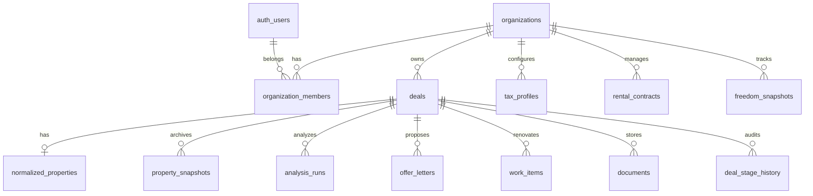

# Schema ER — Deal Desk Immobiliare

## Diagramma entità principali

## Tabelle

### organizations
| Colonna | Tipo | Note |
|---------|------|------|
| id | uuid PK | |
| name | text | Ragione sociale |
| vat_number | text | P.IVA |
| settings | jsonb | Preferenze org |
| created_at | timestamptz | |

### organization_members
| Colonna | Tipo | Note |
|---------|------|------|
| id | uuid PK | |
| organization_id | uuid FK | |
| user_id | uuid FK auth.users | |
| role | text | owner, admin, analyst, viewer |
| created_at | timestamptz | |

### deals
| Colonna | Tipo | Note |
|---------|------|------|
| id | uuid PK | |
| organization_id | uuid FK | |
| title | text | |
| stage | deal_stage enum | lead, analysis, offer, renovation, rental, exit, archived |
| strategy | deal_strategy enum | fix_flip, buy_renovate_rent, buy_hold_sell |
| source_url | text | URL annuncio originale |
| assigned_to | uuid FK | |
| notes | text | |
| created_at / updated_at | timestamptz | |

### normalized_properties
| Colonna | Tipo | Note |
|---------|------|------|
| id | uuid PK | |
| deal_id | uuid FK UNIQUE | |
| organization_id | uuid FK | |
| status | property_status enum | draft, confirmed |
| price_asked | numeric(14,2) | |
| surface_sqm | numeric(10,2) | |
| address | text | |
| zone | text | |
| city | text | |
| province | text | |
| property_type | text | |
| condition | text | |
| rooms | integer | |
| floor | text | |
| energy_class | text | |
| condo_fees_monthly | numeric(10,2) | |
| has_elevator | boolean | |
| has_terrace | boolean | |
| has_parking | boolean | |
| description | text | |
| media_urls | jsonb | |
| location | geography(POINT) | PostGIS |
| raw_fields | jsonb | Campi estratti originali |
| confirmed_at | timestamptz | |
| confirmed_by | uuid FK | |

### property_snapshots
| Colonna | Tipo | Note |
|---------|------|------|
| id | uuid PK | |
| deal_id | uuid FK | |
| source_url | text | |
| snapshot_type | text | html, screenshot, json |
| content | jsonb | |
| captured_at | timestamptz | |

### tax_profiles
| Colonna | Tipo | Note |
|---------|------|------|
| id | uuid PK | |
| organization_id | uuid FK | |
| name | text | Es. "SRL standard 2026" |
| ires_rate | numeric(5,4) | Default 0.24 |
| irap_rate | numeric(5,4) | Default 0.039 |
| registration_tax_rate | numeric(5,4) | |
| vat_rate | numeric(5,4) | |
| seller_type | text | private, company |
| tax_regime | text | registry, vat |
| rental_registration_rate | numeric(5,4) | Default 0.02 |
| is_default | boolean | |
| metadata | jsonb | |

### analysis_runs
| Colonna | Tipo | Note |
|---------|------|------|
| id | uuid PK | |
| deal_id | uuid FK | |
| organization_id | uuid FK | |
| tax_profile_id | uuid FK | |
| assumptions | jsonb | Input completo |
| results | jsonb | base/prudent/stress |
| version | integer | |
| created_by | uuid FK | |
| created_at | timestamptz | |

### offer_letters
| Colonna | Tipo | Note |
|---------|------|------|
| id | uuid PK | |
| deal_id | uuid FK | |
| organization_id | uuid FK | |
| version | integer | |
| offered_price | numeric(14,2) | |
| commercial_text | text | |
| legal_placeholders | jsonb | |
| status | text | draft, sent, accepted, rejected |
| created_by | uuid FK | |
| created_at | timestamptz | |

### work_items
| Colonna | Tipo | Note |
|---------|------|------|
| id | uuid PK | |
| deal_id | uuid FK | |
| organization_id | uuid FK | |
| room | text | |
| category | work_category enum | |
| description | text | |
| unit | text | |
| quantity | numeric(10,2) | |
| unit_price | numeric(12,2) | |
| supplier | text | |
| priority | integer | |
| depends_on | uuid[] | |
| status | work_status enum | planned, in_progress, done |
| requires_permit | boolean | |
| attachments | jsonb | |
| created_at | timestamptz | |

### documents
| Colonna | Tipo | Note |
|---------|------|------|
| id | uuid PK | |
| deal_id | uuid FK nullable | |
| organization_id | uuid FK | |
| name | text | |
| storage_path | text | Supabase Storage |
| mime_type | text | |
| category | text | |
| embedding | vector(384) | pgvector |
| uploaded_by | uuid FK | |
| created_at | timestamptz | |

### rental_contracts
| Colonna | Tipo | Note |
|---------|------|------|
| id | uuid PK | |
| deal_id | uuid FK | |
| organization_id | uuid FK | |
| tenant_name | text | |
| monthly_rent | numeric(12,2) | |
| start_date / end_date | date | |
| registration_done | boolean | |
| condo_fees_tenant | numeric(10,2) | |
| notes | text | |

### freedom_snapshots
| Colonna | Tipo | Note |
|---------|------|------|
| id | uuid PK | |
| organization_id | uuid FK | |
| snapshot_date | date | |
| active_income | numeric(14,2) | |
| passive_income | numeric(14,2) | |
| fixed_expenses | numeric(14,2) | |
| liquidity | numeric(14,2) | |
| reserves | numeric(14,2) | |
| coverage_ratio | numeric(8,4) | |
| metadata | jsonb | |

### deal_stage_history
| Colonna | Tipo | Note |
|---------|------|------|
| id | uuid PK | |
| deal_id | uuid FK | |
| from_stage | deal_stage | |
| to_stage | deal_stage | |
| changed_by | uuid FK | |
| changed_at | timestamptz | |
| note | text | |

## Enum

- `deal_stage`: lead, analysis, offer, renovation, rental, exit, archived
- `deal_strategy`: fix_flip, buy_renovate_rent, buy_hold_sell
- `property_status`: draft, confirmed
- `work_category`: demolition, masonry, electrical, plumbing, hvac, windows, drywall, flooring, tiling, painting, bathroom, kitchen, doors, lighting, furnishing, disposal, inspection
- `work_status`: planned, in_progress, done, cancelled

## Indici consigliati

- `deals(organization_id, stage)`
- `normalized_properties(organization_id)`
- `documents USING ivfflat (embedding vector_cosine_ops)` — dopo popolamento
- `normalized_properties USING GIST (location)`
